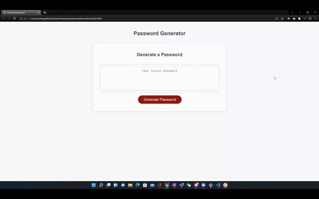

# passwordGenerator

## Description
This is a simple utility that would allow users to randomly generate a password with length of 8-128 digits, from a selected pool of characters, including lower case letters, upper case letters, special characters, and numeric values.

## Demo

## How it works
There are few functions in the script.js file.

1. `btn.onclick` event will call function to set the display property of the form modal to `"block"`, basically from hidden to visible
2. `setCriteria()` is called when Confirm button is clicked, then form values are passed to predefined variables, and will call `checkCriteria()` function
3. `checkCriteria()` function will check whether use typed in a number that's within 8-128 range, and at least one of the character pools is selected, this function will return `false` if criteria is invalid, and return `true` is valid
4. `writePassword()` function will be executed if `checkCriteria()` returns `true`, and starts to call `generatePassword()` as well as closing the modal, displaying the password, copy to clipboard, and alert window message
5. `generatePassword()` is the one that generates the password text given the length, character pool selection

